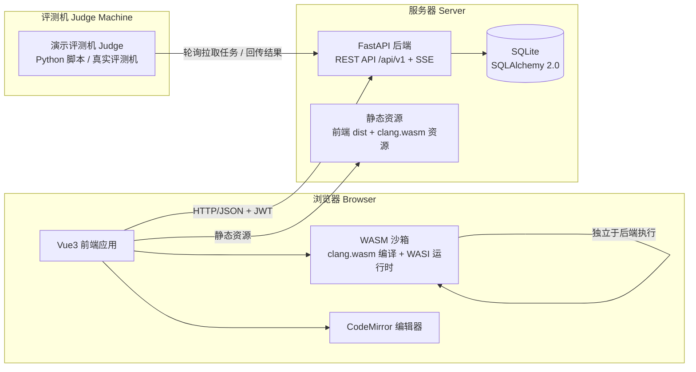
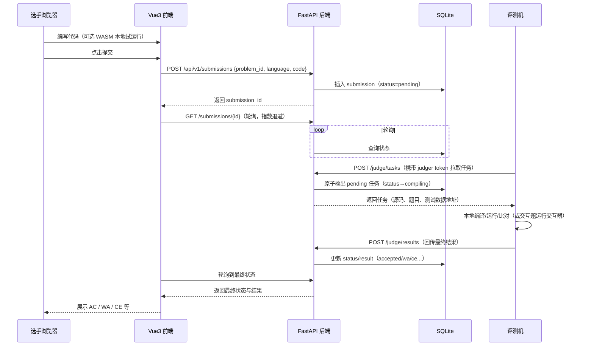
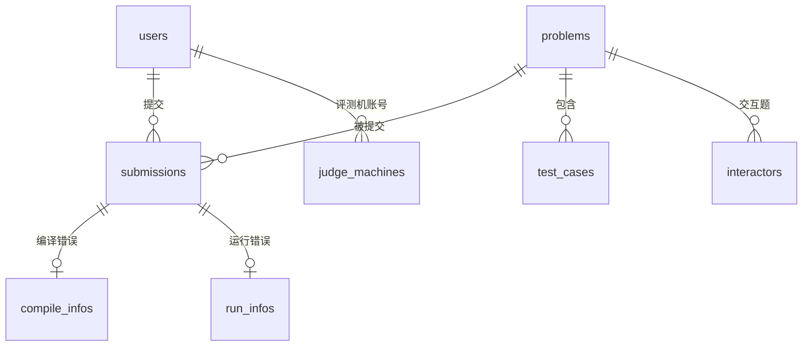
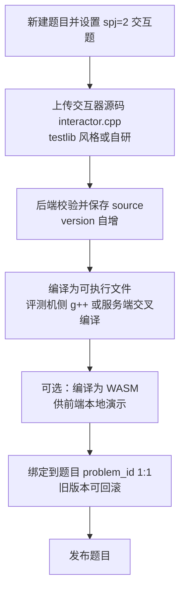
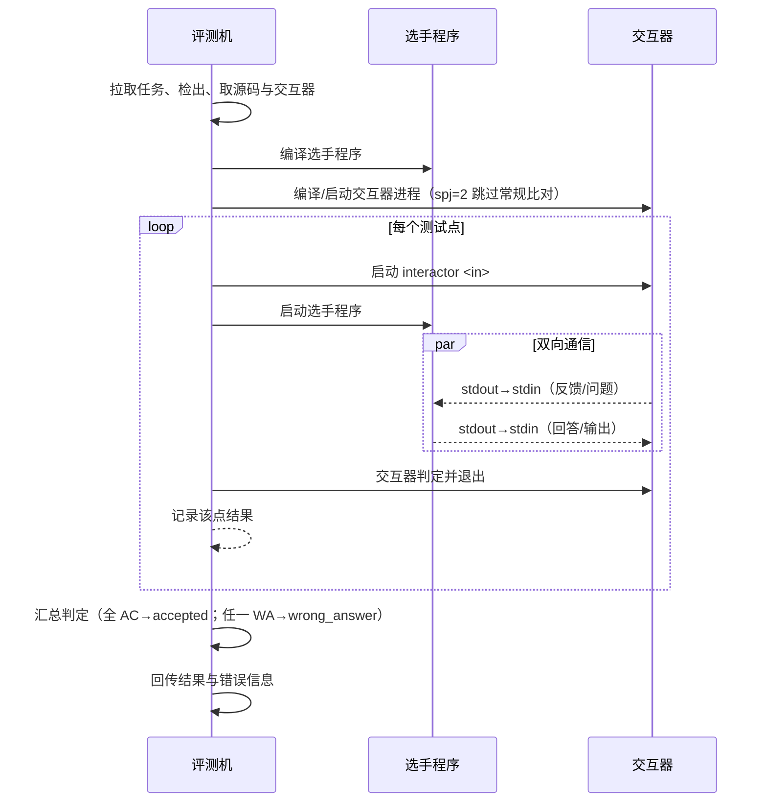

# OJ 在线测评系统（Web 端）建设方案

> 版本：v1.0　|　日期：2026-08-20　|　状态：方案（待开发实施）
> 面向场景：XCPC / ACM 竞赛在线测评（选手在线做题、提交代码、获取评测结果）

---

## 目录

- [1. 项目概述](#1-项目概述)
- [2. 需求分析](#2-需求分析)
- [3. 总体架构](#3-总体架构)
- [4. 技术选型](#4-技术选型)
- [5. 功能模块设计](#5-功能模块设计)
- [6. 数据库设计](#6-数据库设计)
- [7. 通信题管理深入设计](#7-通信题管理深入设计)
- [8. 接口说明文档](#8-接口说明文档)
- [9. 评测机设计](#9-评测机设计)
- [10. 本地启动演示方案](#10-本地启动演示方案)
- [11. 项目目录结构](#11-项目目录结构)
- [12. 开发里程碑与任务拆解](#12-开发里程碑与任务拆解)
- [附录 A：WASM 编译运行技术细节](#附录-a-wasm-编译运行技术细节)
- [附录 B：参考仓库（CCPCOJ）调研结论](#附录-b-参考仓库ccpcoj调研结论)

---

## 1. 项目概述

### 1.1 项目背景

在线测评系统（Online Judge, OJ）是算法竞赛（XCPC/ACM）与程序设计教学的核心基础设施：选手在浏览器中阅读题目、编写并提交代码，系统自动编译、运行、比对结果并反馈评测状态。本项目建设一个**独立的 Web 端在线测评系统**，面向选手与管理员两大核心人群，并兼容外部评测机接入，同时提供**纯前端的浏览器内编译运行（WebAssembly）**能力，降低对后端评测机的依赖。

### 1.2 项目目标

1. 搭建一套前后端分离的 OJ Web 系统，支持选手在线做题、提交代码、查看评测状态与结果；
2. 支持管理员发布/管理题目、管理用户权限与评测数据；
3. 提供标准化的评测机接入接口（任务拉取、结果回传），支持外部评测机平滑对接；
4. 选手端实现**纯前端 WASM 编译运行 C++**：不依赖后端评测机即可在浏览器内编译并运行代码，展示编译错误信息；提交后生成提交记录并显示最终评测状态（Accepted / Wrong Answer 等）；
5. 深入实现**通信题管理**（交互式题目）：管理员上传/编译/管理交互器（Interactor），系统支持交互题评测流程，并可在前端 WASM 环境下演示；
6. 附完整接口说明文档，支持本地一键启动演示。

### 1.3 交付物

| 交付物 | 说明 |
|--------|------|
| 本方案文档 | 架构、数据库、接口、模块、评测机、演示方案等完整设计 |
| OJ_web 项目源码 | 前端（Vue3）+ 后端（FastAPI）+ 演示评测机脚本 |
| 接口说明文档 | 随项目附带（`docs/api.md`），本方案第 8 章为摘要 |
| 本地演示 | seed 数据 + 一键启动脚本 + 演示评测机 |

---

## 2. 需求分析

### 2.1 功能需求清单（对应 6 项硬性要求）

| 编号 | 要求 | 功能点 | 验收标准 |
|------|------|--------|----------|
| R1 | 用户与权限 | 注册/登录/退出；角色区分**管理员（admin）**与**选手（contestant）**，另设**评测机账号（judger）**；JWT 鉴权 + 路由级权限校验 | 管理员可见后台菜单并管理题目/用户；选手仅可见选手端功能；评测机账号仅可访问评测机接口 |
| R2 | 题目发布与代码提交 | 题目 CRUD（描述、输入输出格式、样例、时间/内存限制、SPJ/交互题标记）；选手提交代码（多语言，C++ 为主）；提交记录展示**评测状态与结果** | 管理员可发布题目并立即在前台可见；选手可提交并获得状态流转（pending→running→accepted/wa/ce 等）；提交记录页展示状态与结果 |
| R3 | 评测机接口 | 评测机**任务拉取**、任务检出、测试数据拉取、**结果回传**、编译/运行错误信息回传；含鉴权与心跳 | 演示评测机脚本可跑通"拉取→评测→回传"闭环；真实评测机可按同一 API 协议对接 |
| R4 | 纯前端 WASM 编译运行 | 选手端代码编辑器内**一键编译运行 C++**（clang→WASM 浏览器内编译）；展示编译错误/程序输出；**提交后生成提交记录并显示最终状态 AC/WA** | 输入合法 C++ 源码可编译运行；输入错误代码可展示编译错误信息；提交后提交记录显示 accepted 或 wrong answer 等最终状态 |
| R5 | 深入业务模块 | **通信题管理**（交互式题目）：交互器管理、交互题评测流程、前端 WASM 演示 | 管理员可上传/编译/替换交互器；交互题可完成评测；前端演示交互题本地运行 |
| R6 | 文档与演示 | 接口说明文档；本地可启动演示 | 按文档步骤可本地启动前后端 + 演示评测机；提供 seed 数据（含 admin 账号、示例题目、示例提交） |

### 2.2 角色与用例

```
选手(contestant)
  ├─ 注册/登录、修改资料
  ├─ 浏览题库、查看题目详情
  ├─ 编写代码 → 本地 WASM 编译运行（不依赖评测机）
  ├─ 提交代码 → 查看提交记录与评测状态/结果
  └─ 提交通信题代码 → 本地 WASM 演示交互流程

管理员(admin)
  ├─ 用户管理（禁用/启用、重置密码、分配角色）
  ├─ 题目管理（发布/编辑/隐藏/删除、测试数据上传）
  ├─ 交互器管理（上传/编译/版本替换）
  ├─ 提交管理（查看提交、重判）
  └─ 评测机账号管理（创建 judger 账号、查看在线状态）

评测机(judger, 程序化账号)
  ├─ 登录获取会话（token）
  ├─ 拉取待判任务（支持多机分片）
  ├─ 原子检出任务、拉取测试数据
  └─ 回传结果与错误信息
```

### 2.3 非功能需求

| 类别 | 要求 |
|------|------|
| 性能 | 单机 SQLite 支撑百级并发提交；评测任务领取采用原子 SQL 避免竞态 |
| 安全 | 密码哈希存储（bcrypt）；JWT 过期与刷新；评测机接口独立鉴权；SQL 注入防护（ORM）；代码长度限制 |
| 可维护性 | 前后端分离、目录清晰、API 版本化（`/api/v1`） |
| 可演示性 | 本地零配置（SQLite + 内置样例评测机）即可跑通全流程 |
| 合规 | 不复制参考仓库 CCPCOJ 源码，仅借鉴其业务设计 |

---

## 3. 总体架构

### 3.1 架构图



### 3.2 分层说明

| 层 | 组成 | 职责 |
|----|------|------|
| 展示层 | Vue3 SPA（选手端/管理端） | 页面渲染、交互、状态管理（Pinia）、路由守卫（权限） |
| WASM 层 | clang.wasm + wasi-libc sysroot + WASI 运行时桥接 | 纯前端编译运行 C++，重定向 stdin/stdout/stderr |
| 接口层 | FastAPI REST API + SSE | 认证、题目、提交、评测机接口、通信题接口 |
| 数据层 | SQLite + SQLAlchemy | users/problems/test_cases/submissions/interactors/judge_machines 等表 |
| 评测层 | 演示评测机（Python）+ 真实评测机（可替换） | 拉取任务、编译运行、回传结果；交互题运行交互器 |

### 3.3 核心业务时序（提交→评测→结果）



---

## 4. 技术选型

### 4.1 选型总览

| 层 | 技术 | 版本 | 选型理由 |
|----|------|------|----------|
| 前端框架 | Vue 3 + Vite | Vue 3.4+ / Vite 5+ | 组件化、开发效率高、生态成熟；组合式 API 便于 WASM 封装 |
| 前端状态/路由 | Pinia + Vue Router | 2.x / 4.x | 官方推荐，类型友好 |
| UI 组件 | Element Plus | 2.x | 管理端表格/表单/对话框组件齐全 |
| 代码编辑器 | CodeMirror 6 | 6.x | 轻量、易于嵌入 WASM 自定义语言模式（C++ 高亮） |
| 后端框架 | Python FastAPI | 0.110+ | 异步高性能、自动 OpenAPI 文档（Swagger）、类型校验 |
| ORM | SQLAlchemy 2.0 | 2.0.x | 成熟 ORM，SQLite 开箱即用，便于迁移到 MySQL/PostgreSQL |
| 数据库 | SQLite | 3.x（内置） | 零配置文件数据库，本地演示最佳；生产可平滑迁移 |
| 认证 | JWT（python-jose + passlib/bcrypt） | - | 无状态、前后端分离友好 |
| WASM 编译 | Clang/LLVM → WebAssembly（wasi-sdk 路线） | clang 17+ | 浏览器内真实编译 C++（Compiler Explorer 已验证路线） |
| WASM 运行 | WASI 运行时（wasmtime-javascript 或自研 syscall 桥接） | - | 在浏览器内运行编译产物，重定向标准 IO |
| 评测机 | Python 演示评测机脚本 | 3.11+ | 演示全流程；协议与真实评测机一致，可替换 |

### 4.2 关键选型说明

#### 4.2.1 为什么选 SQLite

- 本地演示**零配置**（无需安装 MySQL/Redis）；单文件数据库便于拷贝分发；
- 本项目评测队列用"数据库状态位"实现（借鉴 CCPCOJ：无独立消息队列），SQLite 的原子 SQL 足够支撑演示规模；
- SQLAlchemy 抽象层保证后续可迁移至 MySQL。

#### 4.2.2 为什么选 C++（clang→WASM）作为浏览器内编译语言

- **浏览器内编译 Go 工具链不可行**：Go 编译器未移植到 WASM，无法在浏览器中编译 Go 源码（Go 仅支持运行预编译的 `.wasm` 文件）；
- **clang 可编译为 WASM**：LLVM 项目已验证该路线（Compiler Explorer / godbolt.org 生产使用），可将 clang 前端 + wasm-ld 链接器 + wasi-libc sysroot 交叉编译为 `clang.wasm`，在浏览器中真实完成"源码→目标码→链接→运行"；
- C++ 是 ACM/ICPC 竞赛主流语言，与本项目竞赛场景匹配。

#### 4.2.3 WASM 资源体积与加载优化

`clang.wasm` 体积较大（约 50~90MB 压缩前），方案采用以下策略（详见附录 A）：

1. **按需懒加载**：仅在选手点击"运行"时动态 `import()` WASM 资源模块；
2. **浏览器缓存**：静态资源带版本号，利用 HTTP 缓存 + `CacheStorage` 二次缓存；
3. **压缩分片**：`.wasm` 采用 gzip/brotli 压缩（clang.wasm 可压缩至 ~20MB），必要时拆分为 streaming compile 分片；
4. **演示降级路径**：提供"本地演示模式"——若浏览器/网络受限，可回退到后端沙箱运行（可选开关），保证演示不被资源下载卡住。

---

## 5. 功能模块设计

### 5.1 用户与权限模块（R1）

#### 5.1.1 角色模型

| 角色 | role 字段 | 说明 | 可访问功能 |
|------|-----------|------|-----------|
| 管理员 | `admin` | 超级管理员，拥有全部权限 | 后台全部 + 选手端 |
| 选手 | `contestant` | 默认注册角色 | 题库、提交、查看状态 |
| 评测机 | `judger` | 程序化账号，仅用于评测机通信 | 仅评测机 API |

> 借鉴 CCPCOJ 的"全局管理→分域管理→条目级权限"思想，本系统 v1 采用简化 RBAC（role 字段 + 路由守卫），预留 `permissions` 表支持后续细粒度扩展（如 `problem_editor`、`contest_editor`）。

#### 5.1.2 认证与授权流程

- **注册**：选手自助注册（user_id、昵称、邮箱、密码），密码 bcrypt 哈希入库；
- **登录**：`POST /api/v1/auth/login` 返回 `access_token`（JWT，含 user_id + role，有效期如 24h）与用户信息；
- **鉴权**：前端 Axios 拦截器附加 `Authorization: Bearer <token>`；后端依赖注入校验 JWT 并读取当前用户；
- **路由守卫**：Vue Router 按角色配置 meta（`roles: ['admin']`），无权限重定向；
- **评测机账号**：管理员在后台创建 `judger` 角色账号；评测机用该账号登录获取 token 后访问 `/judge/*` 接口（接口层单独校验 role==judger）。

#### 5.1.3 主要页面

| 页面 | 角色 | 说明 |
|------|------|------|
| 登录/注册 | 公开 | 表单校验、错误提示 |
| 个人中心 | 选手 | 修改昵称/邮箱/密码 |
| 用户管理 | 管理员 | 列表、禁用/启用、重置密码、角色调整 |
| 评测机账号 | 管理员 | 创建/删除 judger 账号、查看最近活跃时间 |

### 5.2 题目发布与代码提交模块（R2）

#### 5.2.1 题目管理（管理员）

- **题目字段**：title、description（Markdown）、input、output、sample_input、sample_output、hint、time_limit(ms)、memory_limit(MB)、`spj`(0/1/2：普通/SPJ/交互题)、defunct(是否隐藏)、source；
- **测试数据管理**：后台上传 `xxx.in` / `xxx.out` 配对文件或 zip 压缩包（自动解压）；交互题可上传交互器源码（见第 7 章）；
- **发布流程**：新建题目默认 `defunct=true`（隐藏防泄漏），完成后点击"发布"置为可见。

#### 5.2.2 提交（选手）

- 题目详情页内嵌 CodeMirror 编辑器，支持选择语言（C++ 默认），代码长度限制（如 6 ~ 64KB）；
- 提交接口校验登录、题目存在、语言合法、长度合法，并做提交频率限制（如 5 秒内不能连交，借鉴 CCPCOJ）；
- 提交后跳转提交记录页（或弹窗内展示实时状态）。

#### 5.2.3 提交状态机与结果枚举（核心）

状态（`status`）与结果（`result`）合并为一个字段 `status`，取值如下（借鉴 CCPCOJ 枚举并精简）：

| 值 | 定义 | 含义 |
|----|------|------|
| `pending` | PD | 排队等待评测 |
| `compiling` | CI | 编译中（任务已派发/检出） |
| `running` | RJ | 运行评测中 |
| `accepted` | AC | 通过 |
| `presentation_error` | PE | 格式错误（演示评测机可不用） |
| `wrong_answer` | WA | 答案错误 |
| `time_limit_exceeded` | TLE | 超时 |
| `memory_limit_exceeded` | MLE | 内存超限 |
| `output_limit_exceeded` | OLE | 输出超限 |
| `runtime_error` | RE | 运行时错误 |
| `compile_error` | CE | 编译错误（含编译错误信息展示） |

状态流转：`pending → compiling → running → {accepted | wrong_answer | compile_error | ...}`

字段：`time_used(ms)`、`memory_used(KB)`、`judger`（执行评测的评测机账号）、`judge_time`、`compile_info`、`run_info`、`pass_rate`（预留 OI 分制）。

#### 5.2.4 提交记录展示（前端）

- **列表页**：题目、语言、提交时间、状态徽章（AC 绿 / WA 红 / CE 橙 / 运行中动画）、耗时/内存、重判按钮（管理员）；
- **状态刷新策略**：借鉴 CCPCOJ 的**指数退避轮询**——仅对列表中 `status ∈ {pending, compiling, running}` 的在跑提交，批量请求 `GET /submissions/status?ids=...`，按 `2s → 4s → 8s` 退避，全部终态后停止；避免全表高频轮询；
- **详情页**：查看源码、编译错误信息（CE 时）、运行结果摘要。

### 5.3 评测机接口模块（R3）

评测机为独立客户端，通过 HTTP API 与 Web 解耦（借鉴 CCPCOJ 的 judged daemon 架构，升级为 token 认证）。接口一览（详见第 8 章）：

| 接口 | 方向 | 说明 |
|------|------|------|
| `POST /api/v1/judge/login` | 评测机→Web | 用 judger 账号换 token |
| `POST /api/v1/judge/tasks` | 评测机→Web | 拉取待判任务（支持多机分片 `mod`/`total`、`max_running`） |
| `POST /api/v1/judge/tasks/{sid}/checkout` | 评测机→Web | 原子检出任务（防止多机重复领取） |
| `GET  /api/v1/judge/tasks/{sid}/source` | 评测机→Web | 获取源码 |
| `GET  /api/v1/judge/tasks/{sid}/problem` | 评测机→Web | 获取题目限制与测试数据清单 |
| `GET  /api/v1/judge/testdata/{pid}/{file}` | 评测机→Web | 下载单个测试数据文件 |
| `POST /api/v1/judge/results` | 评测机→Web | 回传最终结果（result/time/memory/pass_rate） |
| `POST /api/v1/judge/results/{sid}/compile-info` | 评测机→Web | 回传编译错误信息 |
| `POST /api/v1/judge/results/{sid}/run-info` | 评测机→Web | 回传运行错误信息 |
| `POST /api/v1/judge/heartbeat` | 评测机→Web | 心跳（更新 judge_machines 在线状态） |

**防重复领取设计**（借鉴 CCPCOJ `judge_checkout`）：检出 SQL 形如
`UPDATE submissions SET status='compiling', judger=:me, judge_time=now() WHERE id IN (待判列表) AND status='pending'`，利用 SQLite 单写事务保证原子性；同时允许"卡死回收"——`status IN (pending, compiling, running) AND judge_time < now()-900s` 的提交可被重新领取。

**多评测机分片**：评测机携带 `mod` 与 `total`（如 `mod=0,total=2`），服务端只返回 `id % total == mod` 的任务，实现多机横向扩展。

### 5.4 纯前端 WASM 编译运行模块（R4）

#### 5.4.1 模块定位

选手在题目详情页点击"运行"时，代码**全部在浏览器本地**完成编译与执行，不经过后端与评测机。该功能用于**本地试运行**（验证样例），与"提交评测"（走后端评测机）分离。

#### 5.4.2 技术路线（clang→WASM）

1. **工具链资源**：预先将 LLVM/Clang 交叉编译为 `clang.wasm`，配合 `wasm-ld.wasm` 链接器与 `wasi-libc sysroot`（头文件/库），打包为前端静态资源目录 `public/wasm/`（版本化）；
2. **编译**：前端加载 `clang.wasm`，通过 WASI 接口将用户源码写入内存文件系统，执行 `clang++ --target=wasm32-wasi -O2 -o a.wasm source.cpp`；编译期 stderr 重定向到 UI，**展示编译错误/警告**；
3. **链接**：需要时执行 `wasm-ld` 链接标准库；
4. **运行**：用 WASI 运行时（wasmtime-javascript 或自研 WASI syscall 桥接）加载 `a.wasm`，将题目样例输入写入 stdin，捕获 stdout 输出，程序退出码与输出展示给选手；
5. **资源加载优化**：懒加载 + 版本化缓存 + 压缩分片 + 降级路径（详见附录 A）。

#### 5.4.3 演示形态（对应验收：提交记录显示 AC/WA）

- 选手先用 WASM 本地试运行自测；
- 点击"提交"走后端评测机，评测机按标准流程评测（可用"示例评测机"模拟），提交记录最终显示 `accepted` 或 `wrong_answer`；
- 为满足"纯前端即可判定 AC/WA"的演示场景，前端 WASM 试运行模块同时提供**本地自测**：内置样例输入/输出比对，本地即时给出 PASS / FAIL 提示（纯前端判定），并可一键将其作为一次正式提交写入后端生成提交记录。

### 5.5 通信题管理模块（R5，深入设计见第 7 章）

- 管理员为题目设置 `spj=2`（交互题），上传交互器源码（`interactor.cpp`，testlib 风格），后台提供**编译**（生成交互器可执行文件/或 WASM）与**版本替换**；
- 评测机评测交互题时：启动**独立进程运行交互器**，与选手程序通过 stdin/stdout 管道双向通信，根据交互器退出码与选手程序行为判定结果；
- 前端 WASM 环境提供交互题**本地演示**：交互器以 JS/TS 实现或交互器源码经 clang-wasm 编译后与选手 WASM 程序经 WASI 管道互通。

---

## 6. 数据库设计

数据库采用 SQLite，通过 SQLAlchemy 2.0 定义模型。以下为核心表结构（字段、类型、约束、说明）。

### 6.1 ER 总览



### 6.2 表结构

#### users（用户表）

| 字段 | 类型 | 约束 | 说明 |
|------|------|------|------|
| id | INTEGER | PK AUTOINCREMENT | 主键 |
| user_id | VARCHAR(64) | UNIQUE NOT NULL | 登录账号 |
| password_hash | VARCHAR(128) | NOT NULL | bcrypt 哈希 |
| nickname | VARCHAR(64) | NOT NULL | 昵称 |
| email | VARCHAR(128) | UNIQUE | 邮箱 |
| role | VARCHAR(16) | NOT NULL DEFAULT 'contestant' | `admin`/`contestant`/`judger` |
| status | VARCHAR(16) | DEFAULT 'active' | `active`/`disabled` |
| created_at / updated_at | DATETIME | NOT NULL | 时间戳 |

#### problems（题目表）

| 字段 | 类型 | 约束 | 说明 |
|------|------|------|------|
| id | INTEGER | PK | 题目 ID（对外展示） |
| title | VARCHAR(128) | NOT NULL | 标题 |
| description / input / output / hint | TEXT | | Markdown 描述 |
| sample_input / sample_output | TEXT | | 样例（前端展示 + WASM 本地自测） |
| time_limit | INTEGER | DEFAULT 1000 | 时限(ms) |
| memory_limit | INTEGER | DEFAULT 256 | 内存限制(MB) |
| spj | INTEGER | DEFAULT 0 | 0 普通 / 1 SPJ / **2 交互题** |
| defunct | BOOLEAN | DEFAULT 1 | 是否隐藏（默认隐藏防泄漏） |
| source | VARCHAR(128) | | 题目来源 |
| accepted / submit | INTEGER | DEFAULT 0 | 统计 |
| created_by | INTEGER | FK users.id | 出题人 |
| created_at / updated_at | DATETIME | | |

#### test_cases（测试数据表）

| 字段 | 类型 | 约束 | 说明 |
|------|------|------|------|
| id | INTEGER | PK | |
| problem_id | INTEGER | FK problems.id NOT NULL | 所属题目 |
| name | VARCHAR(128) | NOT NULL | 数据文件名（如 `1.in`） |
| input_file | TEXT | | 输入文件存储路径/内容 |
| output_file | TEXT | | 输出文件存储路径/内容 |
| order_no | INTEGER | DEFAULT 0 | 评测顺序 |
| score | INTEGER | DEFAULT 0 | 分值（OI 分制预留） |

#### submissions（提交表，兼作评测任务队列）

| 字段 | 类型 | 约束 | 说明 |
|------|------|------|------|
| id | INTEGER | PK | 提交 ID |
| user_id | INTEGER | FK users.id NOT NULL | 提交者 |
| problem_id | INTEGER | FK problems.id NOT NULL | 题目 |
| language | VARCHAR(32) | NOT NULL DEFAULT 'cpp' | 语言 |
| code | TEXT | NOT NULL | 源码（列表页不返回） |
| status | VARCHAR(32) | DEFAULT 'pending' | 状态机取值（见 5.2.3） |
| time_used / memory_used | INTEGER | | 耗时(ms)/内存(KB) |
| pass_rate | FLOAT | DEFAULT 0 | OI 分制得分率（预留） |
| judger | VARCHAR(64) | | 执行评测的评测机 user_id |
| judge_time | DATETIME | | 检出/评测时间（用于卡死回收） |
| submitted_at | DATETIME | NOT NULL | 提交时间 |
| is_wasm | BOOLEAN | DEFAULT 0 | 是否 WASM 本地提交（演示） |

> **队列语义**：`status='pending'` 即待判；`compiling/running` 为在判；终态（accepted 等）不再领取。`judge_time < now()-900s` 的在判提交可被重新领取（回收）。

#### compile_infos / run_infos（错误信息表）

| 字段 | 类型 | 约束 | 说明 |
|------|------|------|------|
| id | INTEGER | PK | |
| submission_id | INTEGER | FK submissions.id UNIQUE | 唯一关联提交 |
| info | TEXT | | 编译错误 / 运行错误全文 |
| created_at | DATETIME | | |

#### interactors（交互器表，通信题核心）

| 字段 | 类型 | 约束 | 说明 |
|------|------|------|------|
| id | INTEGER | PK | |
| problem_id | INTEGER | FK problems.id UNIQUE NOT NULL | 交互题题目（1:1） |
| source | TEXT | NOT NULL | 交互器源码（testlib 风格 C++） |
| language | VARCHAR(32) | DEFAULT 'cpp' | |
| compiled_path | VARCHAR(255) | | 编译产物路径（评测机侧） |
| version | INTEGER | DEFAULT 1 | 版本号（每次上传+1） |
| wasm_binary | BLOB / TEXT | | 前端演示用交互器 WASM 二进制（可选） |
| updated_by | INTEGER | FK users.id | 最后更新人 |
| updated_at | DATETIME | | |

#### judge_machines（评测机表）

| 字段 | 类型 | 约束 | 说明 |
|------|------|------|------|
| id | INTEGER | PK | |
| user_id | INTEGER | FK users.id UNIQUE | 关联 judger 账号 |
| name | VARCHAR(64) | | 评测机名称 |
| mod / total | INTEGER | | 分片参数 |
| last_heartbeat | DATETIME | | 最近心跳（在线判定） |
| status | VARCHAR(16) | DEFAULT 'offline' | `online`/`offline` |

#### 索引建议

- `submissions(problem_id, status)`：任务拉取；
- `submissions(user_id, id)`：选手提交历史；
- `submissions(status, judge_time)`：卡死回收扫描；
- `interactors(problem_id)`：交互题关联。

---

## 7. 通信题管理深入设计

> 通信题（交互题，Interactive Problem）是 XCPC 竞赛重要题型：评测不是简单的"程序输出与标准答案比对"，而是**选手程序与一个"交互器"（Interactor）在评测过程中双向通信**。例如"猜数"题：交互器发"太大/太小"，选手程序回复猜测值，双方通过 stdin/stdout 实时对话，最后由交互器判定胜负。

### 7.1 业务概念

| 概念 | 说明 |
|------|------|
| 交互器（Interactor） | 与选手程序通信的裁判程序，读取选手输出、输出反馈、控制交互流程并判定结果 |
| 测试数据 | 交互题通常每个测试点由交互器 + 输入数据驱动，无标准输出文件（或仅有参考） |
| 判定方式 | 由交互器退出码 + 通信协议决定 AC/WA（借鉴 CCPCOJ `spj=2` + testlib 体系） |

### 7.2 交互器管理（管理员）

#### 7.2.1 管理流程



#### 7.2.2 交互器接口规范

交互器作为**独立进程**运行，与选手程序通过管道通信：

- 启动方式：`interactor <input_file> <user_output> <output_file>`（testlib 风格，输出文件由交互器在判定时写入）；
- 通信协议：交互器从 **stdin** 读选手程序输出，向 **stdout** 写反馈（选手程序经管道读取）；选手程序 stdio 与交互器 stdio 互联；
- 判定结果：交互器退出码 `0` = AC，非 0 = WA；异常（未找到交互器、内部错误）标记为系统错误；
- 版本管理：每次上传 `version + 1`，`interactors.version` 记录当前生效版本，支持按版本查看差异。

#### 7.2.3 管理端界面

| 功能 | 说明 |
|------|------|
| 上传/替换交互器 | 编辑器粘贴或文件上传源码，点击"编译并保存" |
| 编译状态 | 展示编译成功/失败 + 错误输出（复用 WASM 编译组件或调用评测机编译） |
| 版本历史 | 列出历史版本、更新时间、更新人，可回滚 |
| 本地调试 | 用内置样例交互流程在后台预演（可对接前端 WASM 演示） |

### 7.3 通信题评测流程（正式评测机）



关键实现点：

1. **管道互联**：用 `subprocess.Popen(..., stdin=PIPE, stdout=PIPE)` 将交互器与选手程序两个进程的 stdio 对接；或选手程序作为交互器的子进程由交互器直接管理（更贴近真实竞赛评测）；
2. **超时控制**：对每次交互设置时限（继承题目 `time_limit`），超时判 TLE，输出超限判 OLE；
3. **错误信息回传**：交互器内部错误/选手 RE 时，回传 `run_info`；编译失败回传 `compile_info`；
4. **多测试点**：每个测试点独立启动一对进程，防止状态污染。

### 7.4 前端 WASM 通信题演示方案（纯前端）

目标：选手在浏览器内**不依赖评测机**地运行交互题，看到与交互器的实时对话。

#### 7.4.1 方案 A（推荐）：交互器用 JS/TS 实现

- 管理端上传交互器时，可选择"使用 JS 交互器模板"：系统生成一个 `interactor.js` 骨架（读取选手输出、返回反馈、判定），管理端编辑保存；
- 前端演示运行时：选手程序以 WASM 进程运行，其 stdin/stdout 通过 WASI 桥接与 JS 交互器以**协程/异步管道**互通；JS 交互器实现按题目逻辑判定；
- 优点：无需在浏览器再编译交互器 C++ 代码，加载快、实现稳、易于演示；
- 局限：JS 交互器与正式评测的 C++ 交互器需保持同一逻辑（文档提示双实现一致性）。

#### 7.4.2 方案 B：交互器源码经 clang-wasm 编译后在浏览器内运行

- 管理端上传 `interactor.cpp` 后，后端（或前端）调用 clang-wasm 将其编译为 `interactor.wasm`（交互器为独立 WASI 进程，无需 Emscripten 主线程限制）；
- 前端运行：选手 `user.wasm` 与 `interactor.wasm` 两个 WASI 实例通过"虚拟管道"（各实例的 fd 重定向到 JS 侧双向缓冲）通信，完整复刻正式评测协议；
- 优点：与正式评测的交互器**完全同源**，演示与真实评测一致；
- 局限：两个 WASM 实例的 IO 桥接实现复杂度较高，交互器编译产物需随题目下发。

#### 7.4.3 演示交互界面

```
┌─ 通信题：Guess the Number ──────────────────────────┐
│ [交互器对话日志]                                     │
│  > Interactor: Guess a number in [1, 100]           │
│  < You: 50                                          │
│  > Interactor: Too high!                            │
│  < You: 25                                          │
│  > Interactor: Correct! You win.                    │
│                                                      │
│ [输入框] 50  [发送]                                  │
│ [代码编辑器（CodeMirror）]    [运行] [提交]          │
│ [结果] PASS（本地交互成功，可作为提交记录）           │
└──────────────────────────────────────────────────────┘
```

#### 7.4.4 降级预案

- 若浏览器无法下载 clang.wasm（网络受限），前端演示自动降级：仅提供"提交"走后端评测机评测（正式评测机执行 C++ 交互器）；
- 交互器 WASM 不可用时，回退到 JS 交互器模板或纯文本协议模拟。

---

## 8. 接口说明文档

> 完整接口文档随项目发布（`docs/api.md`，由 FastAPI 自动生成的 OpenAPI/Swagger 可在启动后访问 `/docs`）。本节为核心接口清单与示例。统一前缀 `/api/v1`，除注明外均需 `Authorization: Bearer <token>`。

### 8.1 认证接口

#### POST /api/v1/auth/register（公开）

请求：
```json
{ "user_id": "alice", "nickname": "Alice", "email": "a@x.com", "password": "******" }
```
响应（成功 201）：
```json
{ "code": 0, "message": "ok", "data": { "id": 1, "user_id": "alice" } }
```

#### POST /api/v1/auth/login（公开）

请求：`{ "user_id": "admin", "password": "******" }`

响应：
```json
{ "code": 0, "data": { "access_token": "eyJhbGciOi...", "token_type": "bearer", "user": { "user_id": "admin", "role": "admin", "nickname": "Admin" } } }
```

#### GET /api/v1/auth/me

响应：`{ "code": 0, "data": { "user_id": "...", "role": "...", "nickname": "..." } }`

### 8.2 题目接口

#### GET /api/v1/problems?page=1&page_size=20

响应（列表不返回测试数据）：
```json
{ "code": 0, "data": { "total": 42, "items": [ { "id": 1001, "title": "A+B Problem", "accepted": 10, "submit": 20 } ] } }
```

#### GET /api/v1/problems/{id}

响应（选手可见完整描述与样例；`spj=2` 表示交互题）：
```json
{ "code": 0, "data": {
    "id": 1001, "title": "Guess the Number", "description": "...", "input": "...", "output": "...",
    "sample_input": "5", "sample_output": "...", "time_limit": 1000, "memory_limit": 256, "spj": 2
} }
```

#### 管理员：POST /api/v1/admin/problems、PUT /api/v1/admin/problems/{id}、DELETE /api/v1/admin/problems/{id}（role=admin）

创建题目请求示例：
```json
{ "title": "A+B", "description": "计算两个整数的和", "input": "...", "output": "...",
  "sample_input": "1 2", "sample_output": "3", "time_limit": 1000, "memory_limit": 256,
  "spj": 0, "defunct": true, "source": "demo" }
```

#### 管理员：POST /api/v1/admin/problems/{id}/testdata

- multipart/form-data，字段 `file`（`1.in`/`1.out` 或 zip 包，zip 自动解压配对）；
- 返回已接收文件清单与解析结果。

### 8.3 提交接口

#### POST /api/v1/submissions

请求：
```json
{ "problem_id": 1001, "language": "cpp", "code": "#include <bits/stdc++.h>...", "is_wasm": false }
```
响应（201）：
```json
{ "code": 0, "data": { "id": 52001, "status": "pending", "submitted_at": "2026-08-20T10:00:00Z" } }
```

#### GET /api/v1/submissions?user_id=&problem_id=&status=&page=1

响应：
```json
{ "code": 0, "data": { "total": 3, "items": [
    { "id": 52001, "problem_id": 1001, "language": "cpp", "status": "accepted",
      "time_used": 12, "memory_used": 1024, "submitted_at": "..." } ] } }
```

#### GET /api/v1/submissions/status?ids=52001,52002（批量状态查询，前端指数退避轮询用）

响应：
```json
{ "code": 0, "data": [ { "id": 52001, "status": "running" }, { "id": 52002, "status": "wrong_answer" } ] }
```

#### GET /api/v1/submissions/{id}（详情：含 code、compile_info、run_info）

响应：
```json
{ "code": 0, "data": { "id": 52001, "status": "compile_error", "code": "...",
    "compile_info": "source.cpp:3:1: error: expected ';' after expression", "run_info": null } }
```

#### 管理员：POST /api/v1/admin/submissions/{id}/rejudge（重判，status 置为 pending）

### 8.4 评测机接口（role=judger）

#### POST /api/v1/judge/login

请求：`{ "user_id": "judger1", "password": "******" }` → 返回 `access_token`。

#### POST /api/v1/judge/tasks

请求：
```json
{ "mod": 0, "total": 1, "max_running": 2 }
```
响应：
```json
{ "code": 0, "data": [ { "id": 52001, "problem_id": 1001, "language": "cpp", "status": "pending" } ] }
```

#### POST /api/v1/judge/tasks/{sid}/checkout

响应：
```json
{ "code": 0, "data": { "ok": true, "judger": "judger1", "judge_time": "..." } }
```

#### GET /api/v1/judge/tasks/{sid}/source

响应：`{ "code": 0, "data": { "code": "#include...", "language": "cpp" } }`

#### GET /api/v1/judge/tasks/{sid}/problem

响应：
```json
{ "code": 0, "data": { "time_limit": 1000, "memory_limit": 256, "spj": 2,
    "testcases": [ { "name": "1.in", "url": "/api/v1/judge/testdata/1001/1.in" } ],
    "interactor": { "version": 3, "source_url": "/api/v1/judge/testdata/1001/interactor.cpp" } } }
```

#### GET /api/v1/judge/testdata/{pid}/{filename}

响应：文件流（`application/octet-stream`）。文件名白名单：`[0-9a-zA-Z-_.() ]+(\.(in|out|zip))|interactor\.(cpp|cc)|spj\.(c|cc|cpp)`。

#### POST /api/v1/judge/results

请求：
```json
{ "submission_id": 52001, "status": "accepted", "time_used": 12, "memory_used": 1024,
  "pass_rate": 1.0, "run_info": null }
```
响应：`{ "code": 0, "message": "ok" }`

#### POST /api/v1/judge/results/{sid}/compile-info、/run-info

请求：`{ "info": "source.cpp:3:1: error: ..." }`

#### POST /api/v1/judge/heartbeat

请求：`{ "name": "judge-node-1", "mod": 0, "total": 1 }` → 更新 `judge_machines.last_heartbeat`。

### 8.5 交互器接口（管理员）

#### POST /api/v1/admin/problems/{id}/interactor

请求（multipart 或 JSON）：
```json
{ "source": "#include \"testlib.h\"\nint main(int argc, char* argv[]) {...}", "language": "cpp" }
```
响应：`{ "code": 0, "data": { "version": 4, "compiled": true, "compile_output": "" } }`

#### GET /api/v1/problems/{id}/interactor

选手可见交互器源码用于本地演示？默认仅管理员可见，前端演示由题目下发演示交互器（JS 模板）。

### 8.6 通用响应约定

- 成功：`{ "code": 0, "message": "ok", "data": ... }`
- 失败：`{ "code": 4xxxx, "message": "错误描述" }`，常见 40101 未登录 / 40301 无权限 / 40401 不存在 / 42201 参数错误。
- 分页统一参数 `page`、`page_size`。

---

## 9. 评测机设计

### 9.1 定位

评测机是与 Web 解耦的独立客户端。正式生产可用任意语言/沙箱实现，本项目提供 **Python 演示评测机**，完整走通"拉取→检出→取源码/数据→本地编译运行→回传"，并支持**通信题交互评测**。

### 9.2 演示评测机架构

```
judge/
├─ judge_daemon.py   # 主循环：登录→轮询任务→检出→fork 评测→回传
├─ compiler.py       # g++ 编译（普通题/交互器），捕获 stderr
├─ runner.py         # 运行选手程序，setrlimit 限时/限内存，捕获输出
├─ checker.py        # 普通题比对（去空白/忽略行尾），SPJ 支持
├─ interactor_runner.py  # 通信题：启动交互器 + 选手程序，管道互联
└─ http_client.py    # Web API 封装（token 认证、任务/结果/数据下载）
```

### 9.3 主循环逻辑（伪代码）

```python
token = login()                       # POST /judge/login
while True:
    tasks = fetch_tasks(token)        # POST /judge/tasks {mod,total,max_running}
    for sid in tasks:
        if checkout(sid):             # POST /judge/tasks/{sid}/checkout（失败说明被抢，跳过）
            code = fetch_source(sid)
            pinfo = fetch_problem(sid)   # limits, spj, interactor
            result = judge_one(sid, code, pinfo)   # 见 9.4
            report_result(sid, result)  # POST /judge/results [+compile-info/run-info]
    sleep(1)
```

### 9.4 单任务评测流程

1. **编译**：`g++ -O2 -std=c++17 -o /tmp/sol source.cpp`；失败 → 回传 `compile_error` + compile_info，结束；
2. **普通题**：遍历测试点，逐点 `timeout` 运行 + 输出比对：
   - 超时 → `time_limit_exceeded`（该点）；
   - 运行崩溃/非零退出 → `runtime_error`；
   - 输出不一致（忽略尾部空白）→ `wrong_answer`；
   - 全部通过 → `accepted`；按需更新 `time_used/memory_used` 取最大值；
3. **通信题（spj=2）**：见 7.3 与 9.5；
4. **回传**：`POST /judge/results`，带 `run_info`（RE 时）。

### 9.5 通信题交互评测实现（Python）

```python
def judge_interactive(sol_exe, interactor_exe, test_input, time_limit):
    for _ in range(steps_limit):                 # 防死循环
        with Popen([interactor_exe, test_input, user_out, std_out], stdin=PIPE, stdout=PIPE) as it, \
             Popen([sol_exe], stdin=PIPE, stdout=PIPE) as sol:
            # 双向转发：it.stdout → sol.stdin；sol.stdout → it.stdin
            # 借助 select / asyncio 流式转发并记录总耗时
            it_rc = it.wait(timeout=time_limit)
            if it_rc == 0: return "accepted"
            if it_rc in (SPECIAL_WA,): return "wrong_answer"
            return "runtime_error" / 系统错误
```

### 9.6 真实评测机替换说明

- 协议即契约：任何客户端实现同一组 `/judge/*` 接口（token 认证、任务拉取/检出/回传、数据下载）即可替换演示评测机；
- 生产建议：Docker 容器隔离 + `setrlimit`/`ptrace` 系统调用白名单 + iptables 禁网（参考 CCPCOJ 判题沙箱思路）；
- 演示评测机仅在本机运行，无沙箱需求。

---

## 10. 本地启动演示方案

### 10.1 环境要求

- Python 3.11+（FastAPI 后端、演示评测机）
- Node.js 18+（前端构建）
- g++（可选，演示评测机编译选手代码用；纯前端 WASM 演示无需）

### 10.2 目录准备

```bash
# 在 c:/Users/Lud/Desktop/OJ_web 下
oj_web/
├─ backend/   # FastAPI
├─ frontend/  # Vue3
└─ judge/     # 演示评测机
```

### 10.3 启动步骤

```bash
# 1) 后端
cd backend
python -m venv .venv && .venv\Scripts\activate        # Windows（PowerShell）
pip install -r requirements.txt
uvicorn app.main:app --reload --port 8000            # Swagger: http://127.0.0.1:8000/docs

# 2) 初始化数据（首次）
python scripts/seed.py   # 建库 + admin/admin123、demo 选手、示例题目与测试数据、示例提交

# 3) 前端
cd ../frontend
npm install
npm run dev                                          # http://127.0.0.1:5173

# 4) 演示评测机（另一个终端）
cd ../judge
python judge_daemon.py --base-url http://127.0.0.1:8000 --user judger1 --pass ******
```

### 10.4 演示用例（验收路径）

| 步骤 | 操作 | 预期 |
|------|------|------|
| 1 | 访问 `http://127.0.0.1:5173`，用 `admin/admin123` 登录 | 进入管理端，可看到题库管理 |
| 2 | 选手注册/登录，打开示例题 A+B | 显示题目描述与样例 |
| 3 | 在代码编辑器输入合法 C++（求和程序），点"运行" | **纯前端 WASM 编译运行**：显示程序输出与样例比对 PASS |
| 4 | 输入错误 C++（缺分号），点"运行" | 显示**编译错误信息** |
| 5 | 点击"提交"，观察提交记录 | 状态流转 pending→compiling→running→accepted（评测机已跑） |
| 6 | 提交错误答案（如输出 0），观察提交记录 | 显示 wrong_answer |
| 7 | 打开通信题"Guess the Number"，点"运行" | 前端 WASM 演示与 JS 交互器对话，最终 PASS |
| 8 | 提交通信题代码 | 评测机运行 C++ 交互器，回传 accepted/wa |
| 9 | 管理员上传交互器新版 | 版本 +1，编译成功，重判提交生效 |
| 10 | 访问 `http://127.0.0.1:8000/docs` | 可在线调试全部接口（接口说明文档） |

### 10.5 seed 数据清单

- 用户：`admin`(admin)、`demo_user`(contestant)、`judger1`(judger)；
- 题目：`1001 A+B Problem`（普通题，2 个测试点）、`1002 Guess the Number`（交互题，含 JS 交互器 + C++ 交互器源码）；
- 提交：1 条 AC、1 条 WA 示例提交，便于直接展示记录页效果。

---

## 11. 项目目录结构

```
OJ_web/
├─ OJ在线测评系统建设方案.md          # 本方案
├─ docs/
│  └─ api.md                          # 接口说明文档（完整版）
├─ backend/
│  ├─ app/
│  │  ├─ main.py                      # FastAPI 入口（CORS、路由注册）
│  │  ├─ core/                        # 配置、安全（JWT/bcrypt）、依赖注入
│  │  │  ├─ config.py
│  │  │  ├─ security.py
│  │  │  └─ deps.py
│  │  ├─ models/                      # SQLAlchemy 模型（users/problems/...）
│  │  │  ├─ user.py  problem.py  submission.py  interactor.py  judge_machine.py
│  │  ├─ schemas/                     # Pydantic 请求/响应模型
│  │  ├─ api/
│  │  │  ├─ v1/
│  │  │  │  ├─ auth.py  problems.py  submissions.py
│  │  │  │  ├─ judge.py               # 评测机接口
│  │  │  │  └─ admin.py               # 管理员接口（题目/数据/交互器）
│  │  └─ services/                    # 业务逻辑（评测队列、交互器编译、测试数据存储）
│  ├─ scripts/
│  │  ├─ seed.py                      # 建库与演示数据
│  │  └─ init_db.py
│  ├─ data/                           # SQLite 文件 + 测试数据存储
│  ├─ requirements.txt
│  └─ .env.example
├─ frontend/
│  ├─ src/
│  │  ├─ main.ts  router/  stores/    # Pinia
│  │  ├─ api/                         # Axios 封装 + 接口定义
│  │  ├─ views/
│  │  │  ├─ user/                     # 登录/注册/个人中心
│  │  │  ├─ problems/                 # 题库/题目详情（编辑器+WASM 运行+提交）
│  │  │  ├─ submissions/              # 提交记录/详情
│  │  │  └─ admin/                    # 后台：用户/题目/测试数据/交互器/提交
│  │  └─ wasm/                        # WASM 模块
│  │     ├─ loader.ts                 # clang.wasm 懒加载 + 缓存
│  │     ├─ compile.ts                # 编译封装
│  │     ├─ runtime.ts                # WASI 运行时桥接（stdin/stdout/stderr）
│  │     └─ interactor-demo.ts        # 通信题 JS 交互器演示
│  ├─ public/wasm/                    # clang.wasm + wasm-ld + wasi-libc sysroot（版本化，构建时放置）
│  ├─ vite.config.ts  package.json
│  └─ index.html
├─ judge/                             # 演示评测机
│  ├─ judge_daemon.py  compiler.py  runner.py  checker.py
│  ├─ interactor_runner.py  http_client.py
│  └─ README.md
└─ scripts/
   ├─ build_wasm_toolchain.sh         # 交叉编译 clang→WASM 工具链脚本
   └─ start_all.sh / start_all.ps1    # 一键启动演示
```

---

## 12. 开发里程碑与任务拆解

### 12.1 里程碑

| 阶段 | 周期（参考） | 交付 |
|------|--------------|------|
| M1 基础框架 | 1 周 | 前后端脚手架、登录注册、JWT、SQLite 建库、角色路由守卫 |
| M2 题目与提交 | 1 周 | 题目 CRUD、测试数据上传、提交接口、提交记录页（指数退避轮询）、重判 |
| M3 评测机闭环 | 1 周 | 评测机接口（任务/检出/结果/心跳）、Python 演示评测机、普通题评测（AC/WA/CE/TLE/RE） |
| M4 WASM 编译运行 | 1~2 周 | clang.wasm 工具链构建与加载优化、浏览器内编译/运行、编译错误展示、本地自测 PASS/FAIL |
| M5 通信题管理 | 1 周 | 交互器管理（上传/编译/版本）、评测机交互评测、前端 WASM 交互演示 |
| M6 文档与打磨 | 3 天 | docs/api.md、seed 数据、一键启动脚本、演示走查、README |

### 12.2 任务拆解（对应 6 项要求）

| 要求 | 任务 |
|------|------|
| R1 用户与权限 | 用户模型与 bcrypt/JWT；`/auth/*`；前端路由守卫与角色菜单；管理员用户管理页 |
| R2 题目与提交 | 题目模型/CRUD/测试数据上传；提交接口与频率限制；状态机与提交记录页 |
| R3 评测机接口 | `/judge/*` 全部接口 + 原子检出 + 超时回收 + 分片；演示评测机 daemon |
| R4 WASM | clang.wasm 工具链构建；loader/compile/runtime；编辑器集成；编译错误 UI；本地自测 |
| R5 通信题 | 交互器表与上传/编译/版本管理；评测机交互评测；前端 WASM 交互演示（JS 交互器优先） |
| R6 文档与演示 | docs/api.md；seed；启动脚本；演示走查清单（10.4） |

---

## 附录 A：WASM 编译运行技术细节

### A.1 clang→WASM 工具链构建（一次性，构建脚本产出静态资源）

```bash
# 核心步骤（示意）：用 Emscripten 或 LLVM 自身将 clang 交叉编译为 wasm32-wasi 目标
# 1) 获取 LLVM/Clang 源码与 wasi-libc
# 2) 配置 clang 自身为 wasm 目标：
#    cmake -G Ninja ../llvm -DLLVM_ENABLE_PROJECTS=clang;lld \
#      -DLLVM_TARGETS_TO_BUILD="WebAssembly;X86" \
#      -DCMAKE_C_COMPILER=clang --target=wasm32-wasi ...
# 3) 产出 clang.wasm、wasm-ld.wasm、wasm-as 等
# 4) 构建 wasi-libc sysroot（include/ + lib/wasm32-wasi/）
# 5) 全部打包到 frontend/public/wasm/<version>/（gzip/brotli 压缩）
```

### A.2 前端加载与执行（伪代码）

```typescript
// loader.ts：懒加载 + CacheStorage 缓存
async function loadClang() {
  const cache = await caches.open('wasm-toolchain');
  const url = `/wasm/v2/clang.wasm.br`;
  let resp = await cache.match(url);
  if (!resp) { resp = await fetch(url); await cache.put(url, resp.clone()); }
  const bytes = await (await resp).arrayBuffer();
  return WebAssembly.compile(bytes);   // 或 streaming 编译
}

// runtime.ts：WASI 桥接
const wasi = new WASI({
  args: ['clang++', '--target=wasm32-wasi', '-O2', '-o', '/out/a.wasm', '/src/source.cpp'],
  stdin: inputFileSystem,        // 内存文件系统
  stdout: (s) => log(s),
  stderr: (s) => compileErrors.push(s),   // 编译错误实时展示
});
```

### A.3 体积与性能优化清单

1. clang.wasm 按 gzip/brotli 压缩（约 50~90MB → 20~35MB）；
2. 懒加载：点击"运行"才加载，加载过程显示进度条；
3. HTTP + CacheStorage 双层缓存，版本号变更才重新下载；
4. 可选：去掉不需要的后端（删除 AArch64 等目标、裁剪不需要的驱动）进一步瘦身；
5. 降级路径：加载失败提示并引导"改用后端提交评测"。

### A.4 与"提交记录显示 AC/WA"的衔接

- WASM 本地自测（样例比对 PASS/FAIL）为**前端即时反馈**；
- 提交记录中的 accepted/wrong_answer 由**评测机正式评测**写入（演示评测机本地 g++ 即可），两者分离保证真实性，也满足"纯前端编译运行 + 提交记录最终状态"的双重要求。

---

## 附录 B：参考仓库（CCPCOJ）调研结论

> 调研对象：https://github.com/CSGrandeur/CCPCOJ（1.x，ThinkPHP+MySQL Web + C 语言评测机）。**本方案仅借鉴其业务设计，不复制其源码。**

### B.1 可借鉴设计汇总

| 领域 | CCPCOJ 设计 | 本方案落地 |
|------|-------------|-----------|
| 评测机解耦 | 评测机 daemon 通过 HTTP（wget cookie 会话）轮询 Web 接口 | 独立评测机走 REST API + JWT（升级） |
| 任务队列 | 无消息队列，`solution` 表状态位 + 原子检出（result→CI） | SQLite `submissions.status` + 原子 UPDATE 检出 |
| 卡死回收 | `result<2 OR (result<4 AND judgetime<now-900s)` 重新领取 | `status∈在判 && judge_time<now-900s` 回收 |
| 多评测机 | `OJ_TOTAL/OJ_MOD` 分片 | `mod/total` 分片参数 |
| 状态枚举 | PD/PR/CI/RJ/AC/PE/WA/TLE/MLE/OLE/RE/CE/TR/MC | 精简为项目所需状态集 |
| 交互题 | `spj=2` 标记交互题，编译 `spj.cc/tpj.cc`(testlib) 为 checker，交互器独立进程 | `spj=2` + interactors 表 + 评测机管道互联 |
| 前端刷新 | 仅轮询在跑提交、批量拉取、指数退避 | 提交记录页采用相同策略 |
| 权限分层 | 全局→分域→条目级(pro_/con_)→judger 特判 | 简化 RBAC + 预留细粒度扩展 |
| 数据管理 | 测试数据按题目目录 `data/<pid>/`、`*.in/*.out` 配对、zip 上传 | 同思路，SQLite + 文件系统双存 |

### B.2 明确不复用/不抄袭的项

- 全部 PHP/ThinkPHP 代码、C 语言评测机源码、SQL 建表脚本、前端 JS 原样逻辑均不进入本方案与后续代码；
- 仅保留业务概念（状态枚举含义、交互题判定思路、评测机解耦协议思想）作为设计参考。

---

## 结语

本方案覆盖 6 项硬性要求（R1~R6），从架构、模块、数据库、接口、评测机、WASM 编译运行、通信题管理到本地演示与里程碑，均可直接指导 OJ_web 项目的后续开发。实施时以第 12 章里程碑为基线，按第 10 章演示清单验收。
