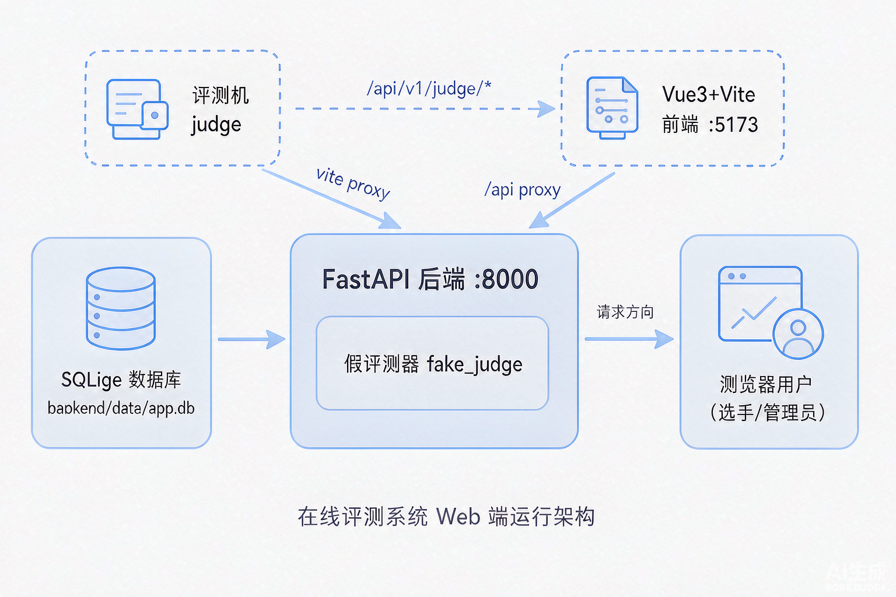

# 实验报告04-在线评测系统web端开发

**报告编号：4　　课题名称：在线评测系统 web 端开发**
**成员：202501100022 刘易桓　　完成方式：独立完成**（与 AI 助手的沟通记录见第 8 节）
**日期：2026-08-22　　依据：docs/plans/2026-08-22.md、README.md、.gitignore**

---

## 1. 基本信息

课题为在线评测系统 web 端开发。本日（第 4 天）工程工作由**刘易桓独立完成**：把第 3 天搭好的工程起步框架调试到位——补评测机接口、重写启动脚本、核对忽略规则、验证建库重置与前后端联跑，并按"一次提交一个可说清的任务"完成 8 次小步 git 提交，仓库干净、冒烟全绿。

## 2. 今日目标

工程起步框架调试（暂停第 5 天前端页面开发，留待明日），5 项任务：① 补全评测机接口 `/api/v1/judge/*`（login/tasks/checkout/source/problem/testdata/results/compile-info/run-info/heartbeat）；② 双平台一键启动脚本；③ 核对忽略规则（依赖/缓存/敏感文件不入库）；④ seed 删库重建可复现；⑤ 前后端联跑打通。验收：删库重建后按 README 可跑通、冒烟全绿。

## 3. 如何启动

**依赖安装（一次即可）**

```
cd backend
python -m venv .venv
.\.venv\Scripts\Activate.ps1        # Windows；Linux 用 source .venv/bin/activate
pip install -r requirements.txt
cd ..\frontend && npm install
```

**启动**（二选一）：一键运行 `scripts\start_all.ps1`（Windows）或 `bash scripts/start_all.sh`（Linux），自动装依赖、建库并拉起前后端；手动则后端 `python -m scripts.seed` 建库 → `uvicorn app.main:app --reload --port 8000`，前端 `npm run dev`。验证：开 `http://127.0.0.1:8000/docs` 或 `http://127.0.0.1:5173`，`GET /api/v1/health` 返回 `{"code":0,...}`。

**停止**：终端按 `Ctrl+C`；端口占用用 `netstat -ano | findstr :8000` 查进程结束。依赖目录与敏感文件已被忽略规则覆盖，克隆后按上述命令重建（见第 6 节）。

## 4. 目录或工程结构

| 目录 / 文件 | 作用 |
|---|---|
| `backend/` | FastAPI 后端：`app/`（路由/模型/服务）、`scripts/`（seed 建库、smoke 冒烟）、`data/`（SQLite，忽略） |
| `frontend/` | Vue3+Vite+TS 前端：`src/` 源码、`vite.config.ts`（/api 代理到 8000） |
| `judge/` | 评测机占位（当前用后端假评测器，真实 daemon 待接入） |
| `scripts/` | 启动脚本 `start_backend` / `start_all`（.ps1 与 .sh 双平台） |
| `docs/` | 方案、接口约定 api.md、数据模型、备忘、当日计划、实验报告 |
| `README.md` 等 | 启动说明 / 忽略规则 / 环境变量示例 |

运行关系如下图：浏览器（前端 5173）经 vite 代理访问后端 8000，后端读写 SQLite 并提供评测机接口，评测机按契约回传结果。



## 5. 审查纪要

刘易桓对初始化骨架逐项通读审查：① 目录应为五区，混入的无关模板与本地产物（tsconfig.tsbuildinfo 等）已删除（c0aee31、cd1fa49）；② 配置读环境变量并带默认值，发现 backend/data 缺失致 SQLite 打不开，已补自动建目录；③ .env 不入库、只留 .env.example，默认密钥已注明生产必须改；④ 与昨日约定一致：7 表模型、`{code,message,data}` 响应、接口与 api.md 相符，评测机失败例（重复检出 ok=false、非法终态 42201、选手 403、文件名白名单）已回填计划书；⑤ 提交体现小步迭代（见下节）。

## 6. 协作与提交

**独立完成**。今日可辨识贡献：评测机接口全集与冒烟用例、跨平台启动脚本、.gitignore 逐条注释、seed 重置复现、前后端联跑、8 次小步提交（工作区干净）。

| # | 提交 | diff 摘要 | 为何而改 |
|---|------|----------|----------|
| 1 | c0aee31 | ignore rules；.gitignore +63，删本地产物 | 防依赖/缓存/敏感文件入库 |
| 2 | 9b159fc | root README；+92 | 他人可按文字启动 |
| 3 | e701649 | backend skeleton + health；9 文件 +138 | 先跑通最小闭环再叠功能 |
| 4 | 278291c | main-path APIs + seed；16 文件 +551 | 主路径接口 + 7 表 + 演示数据 |
| 5 | 6250691 | judge APIs + smoke；4 文件 +367 | 评测机接口落地契约 |
| 6 | cd1fa49 | frontend Vite scaffold；10 文件 +1952 | 前端脚手架基线 |
| 7 | 15e130f | start scripts；4 文件 +46 | 双平台一键启动 |
| 8 | b482c8c | judge README + day4 plan；3 文件 +45 | 记录替换计划与完成情况 |

**3 次高质量提交说明**：c0aee31 新增 .gitignore 63 行并按五类注明原因、删误入库的 tsconfig.tsbuildinfo——仓库不含依赖树与秘密、任何机器可重建；e701649 以 9 文件 +138 行搭最小后端骨架、仅暴露 /api/v1/health——先跑通最小闭环再叠功能；6250691 以 judge.py 267 行实现评测机全部接口并含失败例（重复检出、非法终态、越权、文件名白名单）——把书面契约落成真实代码供评测机对接。

**`.gitignore` 关键段落与逐条原因**：

```
node_modules/                   # 依赖树可由 package.json + lock 重装，提交它拖慢克隆
frontend/dist/                  # Vite 构建产物，随时可由 npm run build 重建
__pycache__/  *.py[cod]         # Python 字节码缓存，解释器自动生成
.venv/  venv/                   # 虚拟环境绑定本机路径，应由 venv + requirements.txt 重装
*.egg-info/  build/  dist/      # Python 打包产物，由清单重建
.pytest_cache/  .mypy_cache/  .ruff_cache/   # 测试/类型检查缓存
.env  *.env.local               # 可能含 SECRET_KEY/口令；仓库只留无秘密的 .env.example
*.pem  *.key  *.p12  *.pfx  id_rsa*          # 私钥/证书，绝不能入库
backend/data/  *.db  *.sqlite*  # 数据库为本地产物，seed 脚本可重建
logs/  *.log                    # 运行日志含本地路径与时间戳
.idea/  .vscode/  *.swp  *~    # 编辑器个人配置与临时文件
.DS_Store  Thumbs.db  Desktop.ini  # 操作系统生成文件
*.tsbuildinfo                   # TypeScript 增量构建缓存
```

规则逻辑：依赖与产物可重建（省体积、防平台不兼容），敏感文件必防泄漏，编辑器/系统文件不进公共仓库。

## 7. 今日完成与自检

- **按启动说明可运行**：删库重建后，后端 8000 health 返回 code=0，前端 5173 返回 200，经代理 /api 返回 code=0，冒烟全绿 ✓；
- **审查事项均已处理**：计划书 5 项任务全部勾选（接口含失败例、脚本实机验证、忽略规则核对、seed 复现、联跑）✓；
- **提交干净**：`git status` 无未提交改动 ✓。

## 8. 问题、计划与 AI 沟通

**不成功的沟通**：助手初始化时脚手架目录臃肿——`git status` 出现大量无关文件；调整为要求"只生成指定目录、不要引入额外框架"并手工删除无关模板。另遇依赖混乱（passlib 与 Python 3.13 兼容差）改 bcrypt 4.2.1；PowerShell 下 git commit 含中文括号报错，改用英文消息。

**有效的沟通**：限定"只生成五个指定目录、不引入额外框架"后得到可用初稿；约定"接口先写主路径一例 + 一类失败例""假实现必须带开关与替换日期"，前后端与评测机据此遵守同一契约。

**明日安排（主路径演示准备）**：先补前端登录/注册页 + 路由守卫 + 题库列表页（接真实接口），再补提交记录页轮询；后端接入真实评测机 judge_daemon.py，跑通"提交→评测→终态"端到端。
