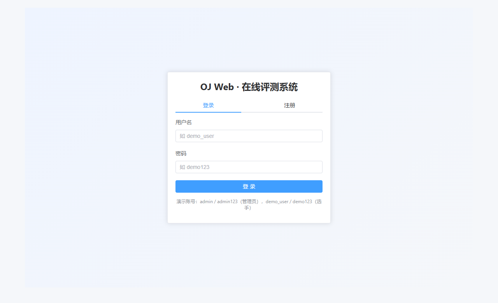
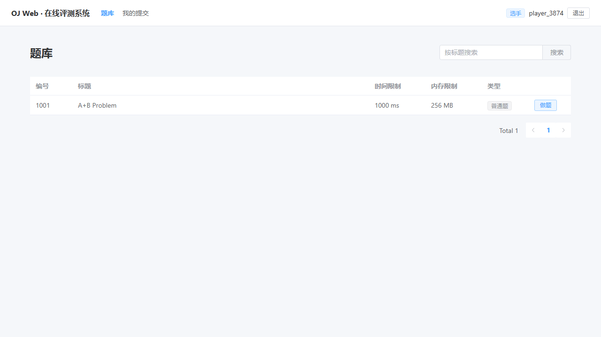
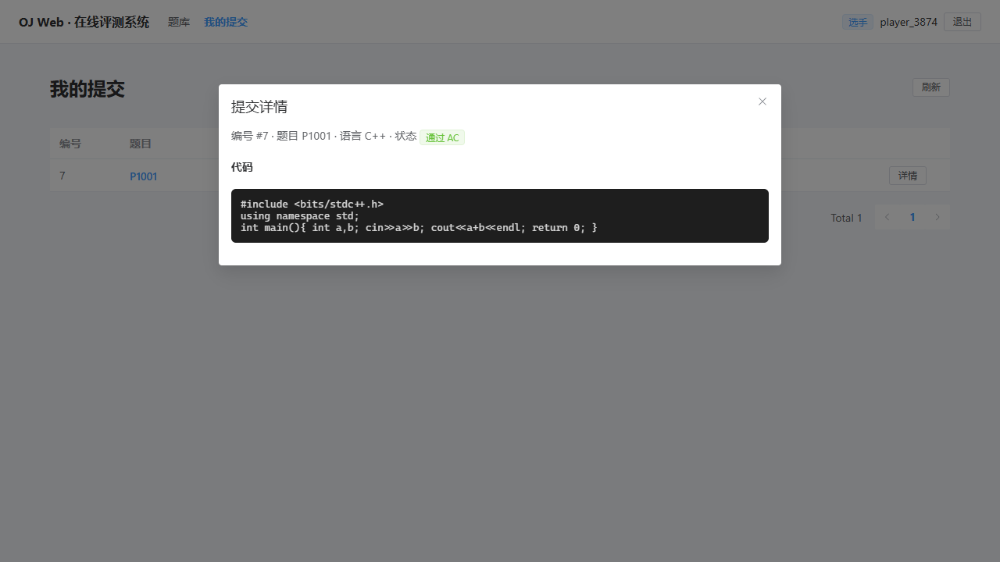

# 实验报告 05（第 5 天 · 2026-08-23）

## 1. 基本信息

- 课题：在线评测系统 web 端开发（OJ_web）
- 人员：刘易桓（202501100022），**独立完成**

## 2. 今日目标

按接口约定贯通主路径并产出**可运行样本**，以**演示说明**形式让他人按步骤复现；为尚未真实可用的部分编写可排期**差距清单**。今日演示做到：**注册/登录 → 题库 → 题目详情 → WASM 运行（临时假实现） → 提交 → 假评测器给出终态**；浏览器内编译与评测两环节因外部依赖未到点，使用临时假实现并明示标注。

## 3. 演示说明

> 环境与启动详细步骤见 `docs/DEMO_GUIDE.md`；本节为可按文字复现的精炼版。**凡涉及临时假实现处均以"⚠假实现"标注**。

### 步骤 1 启动两端
- 后端：`cd backend; .\.venv\Scripts\python -m uvicorn app.main:app --reload --port 8000`
- 前端：`cd frontend; npm run dev`
- **预期**：后端日志出现 `Uvicorn running on http://127.0.0.1:8000`；前端日志出现 `Local: http://localhost:5173/`；`curl http://127.0.0.1:5173/api/v1/health` 经 vite 代理返回 `{"code":0,...}`。

### 步骤 2 访问首页（未登录被重定向）
- 浏览器开 `http://localhost:5173/`。
- **预期**：URL 变为 `http://localhost:5173/login?redirect=/problems`，显示登录卡片与演示账号提示（管理员 admin/admin123、选手 demo_user/demo123）。



### 步骤 3 登录
- 切到"登录"页签，输入 `demo_user / demo123`，点"登录"。
- **预期**：跳转 `http://localhost:5173/problems`，右上角显示当前用户名。

### 步骤 4 浏览题库
- **预期**：题库表格出现 **1001 A+B Problem**，列含编号/标题/时间限制 1000 ms/内存限制 256 MB/类型"普通题"，右侧"做题"按钮；底部 `Total 1`。



### 步骤 5 进入题目详情
- 点击 1001 行右侧"做题"按钮。
- **预期**：URL 变为 `/problems/1001`。左栏显示题目描述/输入输出格式/样例输入 `1 2`/样例输出 `3`；右栏显示语言选择" C++ (GCC17)"、代码框、"运行（WASM 演示）"和"提交评测"两个按钮。

### 步骤 6 WASM 浏览器内运行（⚠假实现）
- 不改默认代码（或自填），点"运行（WASM 演示）"。
- **预期**：右栏出现"运行结果"区块，带黄色"演示模式"标签，下方输出 `1 2`（样例输入回显）。
- **假实现说明**：`VITE_FAKE_WASM=1` 开关控制，固定回显样例输入；**未真实编译运行**。真实 clang.wasm 替换见第 5 节 G2。

### 步骤 7 提交代码
- 在代码框粘贴：
  ```cpp
  #include <bits/stdc++.h>
  using namespace std;
  int main(){ int a,b; cin>>a>>b; cout<<a+b<<endl; return 0; }
  ```
- 点"提交评测"。
- **预期**：提示"已提交 #N，等待评测"，自动跳转 `/submissions?focus=N`。

### 步骤 8 查看终态（⚠假实现）与详情
- 跳转到"我的提交"页后，提交行状态列显示 **通过 AC**，高亮 `focus=N`。
- 点击行内"详情"按钮。
- **预期**：弹出"提交详情"对话框，编号 #N / 题目 P1001 / 语言 C++ / 状态"通过 AC"，下方展示完整代码。



- **假实现说明**：后端 `FAKE_JUDGE=true` 同步判定终态，**未走真实评测机 daemon 编译运行**；耗时/内存非真实值。真实评测机替换见 G1。

## 4. 复现情况

- **本人（刘易桓）按上述步骤在真机浏览器（MS Edge）实机走通 7 步**，对应截图见第 3 节；演示文档 `docs/DEMO_GUIDE.md` 与本节步骤一一对应。
- **未由第二人独立复现**：本日仅单人/单环境验证；按本节"明日安排"，第 6 天上午请同学/同事按 `DEMO_GUIDE.md` 从零走一遍，期间发现的步骤偏差、卡点将回填本节与 `DEMO_GUIDE.md`，**不隐藏**。
- **本次自检中对说明的修改**：① 初版仅写"启动后端、前端"，未明示验证方法——补步骤 1 的 `curl /api/v1/health`；② 初版"运行"步骤未标注"演示模式"——补 ⚠假实现 与替换日期 G2；③ 初版"提交后"未说跳转 URL——补 `/submissions?focus=N`；④ 失败检查 F1–F5 单独放 `DEMO_GUIDE.md`，不在本节重复。

## 5. 差距清单

> 全部任务负责人为刘易桓。阻塞主路径真实可用的事项（**P0**）最先做；非阻塞项可按既定计划排期。

| 编号 | 内容 | 优先级 | 计划日期 |
|------|------|--------|----------|
| G1 | 真实评测机 `judge_daemon.py` 接入：judger1 登录→拉任务→真实编译运行→回传终态；替换后 `FAKE_JUDGE=false` 默认 | **P0** | 第 6 天（2026-08-24） |
| G2 | 真实 WASM 浏览器内编译：懒加载预编译 clang.wasm，输出真实 stdout/stderr；替换后 `VITE_FAKE_WASM=false` | **P0** | 第 6 天（2026-08-24） |
| G3 | 提交轮询改为指数退避 2s/4s/8s（现固定 2s） | P1 | 第 6 天 |
| G4 | 移除 ElDialog 上 v-loading 指令（4 条 Vue warn） | P2 | 第 6 天 |
| G5 | 细粒度权限+管理端：admin 题库管理页、选手路由守卫 | P1 | 第 7 天 |
| G6 | 前端 5s 提交节流提示与 42901 友好转译 | P2 | 第 7 天 |
| G7 | 前端单测与主路径 e2e 脚本入仓（Vitest + playwright） | P2 | 第 8 天 |
| G8 | favicon 404 修复 | P3 | 第 8 天 |

完整四要素（约束/需求/范围/输出）见 `docs/gap_list.md`。

## 6. 今日完成与自检

- **主路径做到**：注册/登录、题库、题目详情、WASM 运行（标注假实现）、提交、假评测器给出终态、提交详情。**真实浏览器全流程走通并截图**。
- **差距是否都列入清单**：演示中标注的两处假实现（G1、G2）已记 P0；自检发现的 v-loading 警告（G4）、favicon 404（G8）、轮询退避不符契约（G3）、缺节流提示（G6）已全部入清单——无遗漏。
- **可运行样本**：克隆代码 → 按 `DEMO_GUIDE.md` 启动 → 主路径可达；**⚠标注的两处并非真实编译/评测**，明日 G1/G2 替换后主路径整体转为真实可用。

## 7. 问题、计划与 AI 沟通

**不成功的沟通（已调整）**：
- 助手初版演示说明像"功能清单"——例如"用户能登录、能看到题库、提交后有结果"，没写"在哪个框输什么、点哪个按钮、看到什么现象"，他人无法照做。调整为按真实点击顺序写"步骤 + 预期现象"，并配截图。
- 助手初版把"WASM 运行"与"提交 AC"写成已完成，未标注假实现。调整为凡使用外部依赖（真实编译/真实评测机）的步骤必须⚠标注，并指明替换日期（G1/G2）。
- PowerShell 传中文到 playwright-cli 出现 UTF-8/GBK 乱码——浏览器定位改用索引/nth，git 中文文件名改用通配符（`git add "*05.md"`）。

**比较有效的沟通**：要求"按主路径走过的真实顺序改写步骤"+"列出哪些是临时假实现"后，得到本节可复现的演示说明（8 步 + 3 张截图 + 假实现标注 + 失败检查回填到 `DEMO_GUIDE.md`）。

**明日安排**：优先完成**G1 真实评测机接入**（P0，阻塞主路径真实性），与 G2 真实 WASM 并行（互不依赖），按"计划—执行—核对"推进；同时穿插 G3/G4 小改；G1 完成后请第二人按 `DEMO_GUIDE.md` 复现一回填复现情况。
