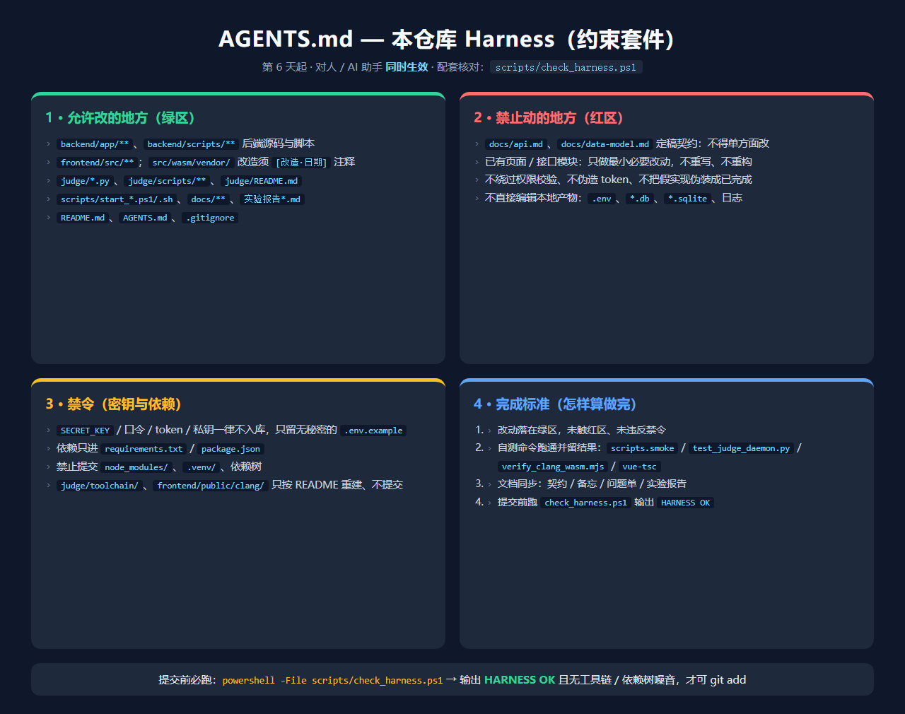
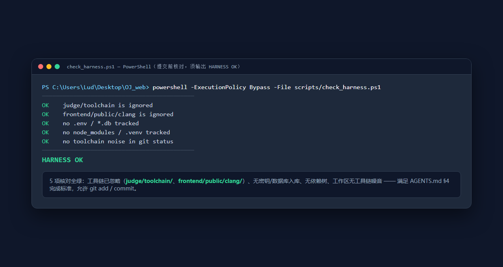

# 实验报告 06（第 6 天 · 2026-08-24）

## 1. 基本信息

- 课题：在线评测系统 web 端开发（OJ_web）
- 人员：刘易桓（202501100022），**独立完成**

## 2. 今日目标

对应第 5 天差距清单的 **G1（真实评测机接入，P0）** 与 **G2（真实 WASM 浏览器内编译，P0）**，两块互不依赖、并行完成；G3/G4 小项按计划顺延。今日另一目标：**把本组 harness（约束套件）写入仓库**——即把"允许改哪里、禁止动哪里、密钥与依赖禁令、怎样算做完"写成人/助手同时生效的规则与可执行核对，再用它管住当天的两块改动，避免改动越界、密钥入库、工具链噪音污染仓库、"做完没做完"说不清。

## 3. 本组 Harness

**管什么**：一句话——仓库的"施工边界 + 禁令 + 验收"：谁的代码能碰、哪些文件绝不碰、什么东西不能入库、一次任务跑通哪几条命令才算完。

**文件位置**（不空建，全部有实际用途）：

- `AGENTS.md`（仓库根）：对人/助手生效的核心规则（绿区/红区/禁令/完成标准）；
- `scripts/check_harness.ps1`：可执行核对（忽略规则、密钥/数据库入库、依赖树、工具链噪音），`HARNESS OK` 才允许提交；
- 配套既有契约：`docs/api.md`、`docs/data-model.md`、`.gitignore`（含原因注释）、`README.md`（启动说明 + harness 指引）。

**对人/助手同时生效的规则（四条）**：

1. **能改**：`backend/app/`、`backend/scripts/`、`frontend/src/`（vendor 改造须 `[改造·日期]` 注释）、`judge/*.py` 与 `judge/scripts/`、启动脚本、`docs/` 与报告；
2. **禁改**：定稿契约 `api.md`/`data-model.md` 不得单方面动（要先改契约并同步调用方）；已有页面/接口模块只做最小必要改动，不重写重构；不绕过权限、不把假实现伪装成已完成；
3. **禁令**：`SECRET_KEY`/口令/token/私钥不入库（只留无秘密的 `.env.example`）；依赖只进 `requirements.txt`/`package.json`，禁止提交 `node_modules/`、`.venv/`；工具链/预编译资源（`judge/toolchain/`、`frontend/public/clang/`）只按 README 重建、不提交；
4. **完成标准**：改动在绿区未触红区 + 至少一项自测命令跑通留结果（`scripts.smoke` / `test_judge_daemon.py` / `verify_clang_wasm.mjs` / `vue-tsc`）+ 文档同步（api/备忘/问题单/报告）+ 提交前 `check_harness.ps1` 输出 `HARNESS OK`。

**AI 生成初稿与人工修订**：请助手"按仓库实际目录分区起草绿区红区，禁令写具体文件名而非'不得泄露'，完成标准写成可执行命令"，避免抄通用模板的空话。人工修订：① 删掉初稿一条过宽的"不得修改任何未在清单列出的文件"（会卡死联调），改为"最小必要改动"；② 把"密钥"从泛化描述具体化为 `.env.example` 白名单；③ 初稿检查脚本中文注释在 PowerShell 5.1 下按 GBK 解码报语法错，全部消息改纯 ASCII 并加编码说明。

**一次实际使用**：两块工作执行在先、harness 收尾补建，因此当天"使用"为**回顾性核对**：跑 `check_harness.ps1` 五项全绿（工具链已忽略、无 `.env/*.db` 入库、无依赖树、无工具链噪音），说明两块改动都落在绿区、未触红区：

**未拦住的实例（如实记录）**：上午下载 w64devkit/clang 资源后未加忽略规则，`git status` 一度出现 **12926 个 untracked 文件**（其中 C/H 头文件约 6096 个），工作区视图被工具链噪音淹没——这正是 harness 缺失时的越界。当天下午补 `.gitignore` 两条规则 + `judge/README.md` 重建脚本后收敛。**收紧措施**：把"工具链只重建不提交"写入 harness §3，并把 `check_harness.ps1` 列为 §4 完成标准第 4 条（提交前必跑）。

## 4. 今日完成的两块

### 块 A：真实评测机（G1）

- **内容/对应需求**：`judge/judge_daemon.py`——judger1 登录→轮询任务→checkout→取源码/题目/数据→本机 g++ 编译→逐测试点运行（时限 + 内存采样）→回传终态 + 心跳；未知语言/spj/无编译器走 `judge_error` 降级。`FAKE_JUDGE` 默认改 `false`，`smoke.py` 加 setdefault 保持冒烟契约。工具链 w64devkit（GCC 16.2）落地 `judge/toolchain/`。
- **改动范围**：`judge/`（daemon + 自测 + README）、`backend/app/core/config.py`、`backend/scripts/smoke.py`、`docs/`。对照 harness：全部在绿区；只按 `api.md` 实现，未动契约本身。
- **自测**：`cd judge && python scripts/test_judge_daemon.py`——HTTP 全链路断言通过（compile_error/judge_error/降级）；T1/T3 曾因 g++ 找不到 `as`（子进程 PATH 未注入）失败，修复后编译运行快速核对 **ALL PASS**（真实耗时 30ms）；契约冒烟 `python -m scripts.smoke` **全绿**。完整复跑（约 40s）留第 7 天留档。

### 块 B：真实 WASM 编译（G2）

- **内容/对应需求**：运行时源码自托管 `frontend/src/wasm/vendor/`（wasm-clang-runtime v0.1.0，Apache-2.0，零 npm 依赖），`runtime.ts` 真实分支（懒加载 Worker + 编译错误翻译），`VITE_FAKE_WASM` 默认 0；资源自托管 `frontend/public/clang/`（clang22/lld22/sysroot22.tar，经 ghfast.top 镜像下载）。
- **改动范围**：`frontend/src/wasm/`、`frontend/.env.development`、`frontend/scripts/`、`docs/`。对照 harness：均在绿区；未改任何页面组件。
- **自测**：`cd frontend && node scripts/verify_clang_wasm.mjs` **6/6 PASS**——clang22 编译 A+B→wasm-ld 链接→运行输出 `3`；语法错误显示真实诊断（`expected '}'`）。浏览器端实测留第 7 天。

## 5. 交叉阅读或互查

独立完成，自我复查要点：① harness 规则是否被"隔一段时间的自己"读懂——绿区/红区按真实目录写、验收是命令而非形容词，可自解释；② 逐条核对 REVIEW_NOTES（A-1~A-6、B-1~B-7）中已修项是否都落在绿区改动内，未修项是否都记入遗留；③ 用 `check_harness.ps1` 与手工 `git check-ignore -v` 交叉验证忽略规则结论一致（`.gitignore:66/68` 命中）。

## 6. 今日完成与自检

- **Harness 已进仓库且规则具体**：`AGENTS.md` 四条（绿区/红区/禁令/验收）+ `check_harness.ps1` 可执行核对 + README 指引；无空文件、无空话。
- **两块均已自测**：块 A 部分断言 + 快速核对 ALL PASS + 冒烟全绿；块 B 6/6 PASS。
- **未列入清单的遗留**：浏览器端真实运行实测（B-6）、块 A 完整自测复跑留档、G3/G4/G6 穿插项、brotli 压缩（B-7）——已记入 `REVIEW_NOTES.md`/`DEV_LOG.md`，属"已知并排期"，非遗漏。

## 7. 问题、计划与 AI 沟通

**不成功的沟通**：
- 初建 harness 时助手按通用模板给了大量"不得泄露密钥""遵守编码规范"式空话，没有仓库内的具体对象——要求改为"按实际目录列绿区红区、禁令写具体文件名、验收写成命令"后重写，删掉空泛条目；
- 工具链下载后未忽略导致 `git status` 上万 untracked（见 §3）——把"只重建不提交"写入 harness 与 `.gitignore` 后收敛；
- `check_harness.ps1` 中文注释在 PowerShell 5.1 报解析错（无 BOM UTF-8 被按 GBK 读）；脚本消息改纯 ASCII 后一次通过。

**比较有效的沟通**：
- 给助手限定"只动 `frontend/src/wasm/` 与 `.env.development`，不改页面组件"，块 B 的 `runtime.ts` 一次改对，`vue-tsc` 类型检查干净；
- 生成 harness 时要求"每条规则必须有仓库里的具体对象（目录/文件名/命令）"，有效避免了抄来的空话。

**明日安排（联调）**：
- 按第 5 天工作流程走：起后端+前端 → 按 `DEMO_GUIDE.md` 2.6/2.7 复跑（真实评测机 + 真实 WASM）→ 请第二人从零复现 → 回填复现情况与截图；
- **harness 需补一条核对命令**：把"块 B 浏览器端实测"写进 AGENTS.md 完成标准（当前仅 Node 链为必跑项），并新增 `docs/` 报告的日期回填检查，防止联调后文档漏同步。
