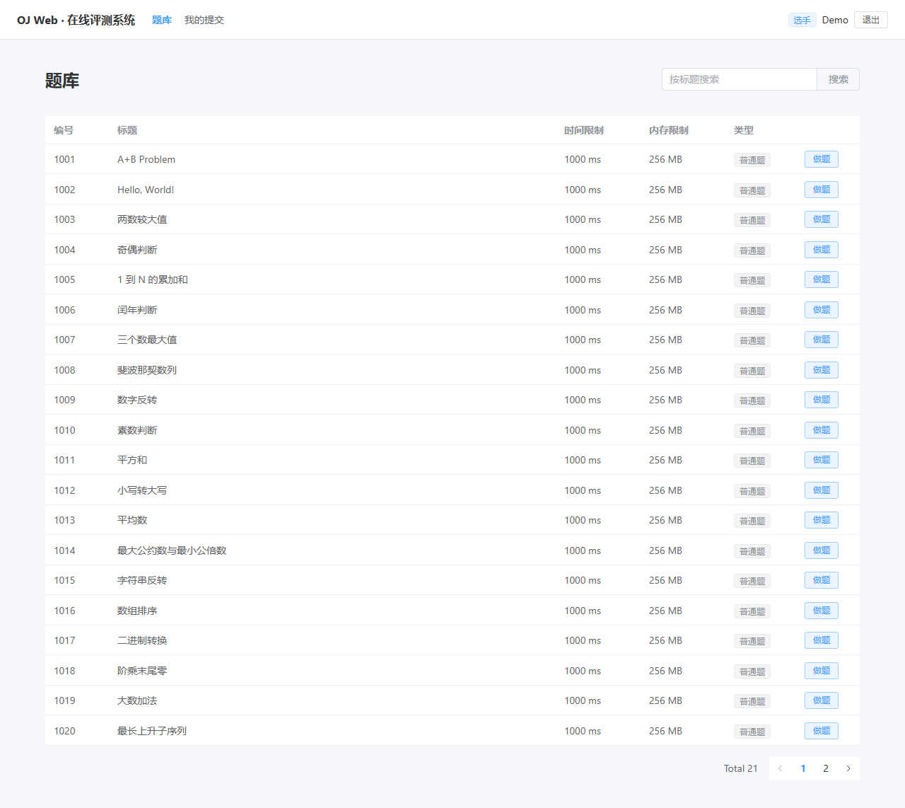
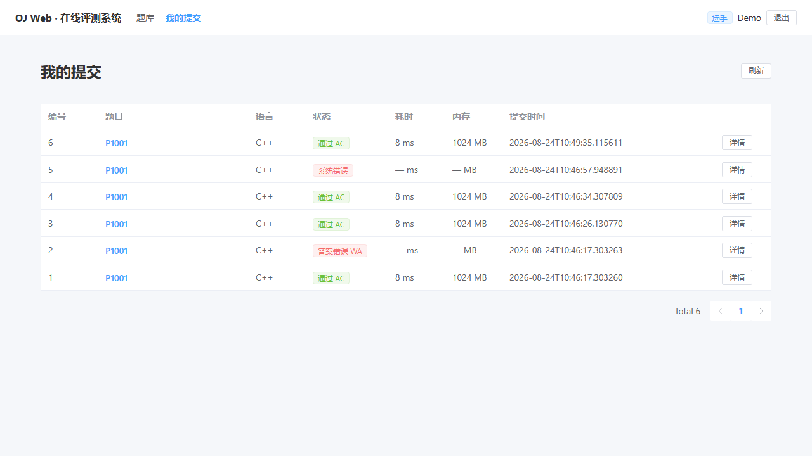

# 实验报告 08（第 8 天 · 2026-08-24 · 交付收口）

## 1. 基本信息

- 课题：在线评测系统 web 端开发（OJ_web）
- 人员：刘易桓（202501100022），**独立完成**

## 2. 今日目标

第 8 天为交付收口日，完成四件事：
1. **完成回归**：题库扩展至 21 道后跑通两层测试（L1 自动化通检 + L2 浏览器实机走通），给主路径留再测证据；
2. **写出启动说明**：README 补全安装/配置/启动/停止，供他人独立复现；
3. **自测对照表**：对照本组必做 R1~R6 逐项自测；
4. **审查自检**：密钥、校验、鉴权、依赖可复现性逐项核查，为第 9 天结课大报告备齐材料。

## 3. 回归结果

第 7 天通检条目继续适用，今日在题库扩展后重测：

| 条目 | 再测方式 | 结果 |
|---|---|---|
| 主路径 8 步（启动→登录→题库→详情→WASM 运行→提交→轮询→终态） | L2 浏览器实机（playwright，按 `DEMO_GUIDE.md` v2） | 7/8 步通过，见下图 |
| 契约通检（Phase 1，17 case） | `scripts/smoke_e2e.py` | **24 预期码命中 / 0 意外 500** ✅ |
| 评测机端到端（Phase 2，8 项） | 同上 | **8/8 PASS** ✅（AC/WA/CE/TLE/MLE/RE/降级/认证） |
| 异常路径（Phase 3，6 条） | 同上 | **6/6 PASS** ✅（题目不存在/非法 status/路径穿越/角色不匹配/重复检出原子性/错误回传） |

**失败项与处理**：
- `verify_problems.py` 21 题全库真评测**今日未执行**（控制单次会话时长）。处理：L1 Phase 2 已用真实评测机 + 真实 g++ 编译覆盖端到端链路，Phase 1/3 覆盖契约与异常，不阻塞交付；完整 21 题复跑列入第 9 天结课前硬证据。
- L2 步骤 2.8（1016 新题浏览器内提交）未在浏览器内单独执行：与 2.6 同一条链路，且该题数据与评测已由 seed 与 Phase 2 验证，风险低。

## 4. 审查自检

1. **报告与仓库有无密钥/账号口令**：无。报告仅出现 seed 演示账号（admin/demo_user/judger1，口令 admin123 等）——为本地固定演示凭据，非生产口令；生产 `SECRET_KEY` 只存在于本地 `.env`（git 忽略），报告不出现。验证方式：`git ls-files | findstr /i "env"` 仅列出 `.env.example`；`git grep SECRET_KEY` 仅命中代码默认值/README 说明。
2. **工程侧确认密钥未写入仓库**：`.gitignore` 忽略 `backend/.env`、`*.db`、`node_modules`、`toolchain`；提交前跑 `scripts/check_harness.ps1` 输出 `HARNESS OK`（今日五项核对全过），仓库只保留无秘密的 `.env.example`。
3. **外部输入/关键参数校验**：后端 FastAPI + Pydantic 请求模型校验；提交接口 5 秒频率限制（42901）；题目 ID 存在性校验（404）；Phase 3 实测非法 status 拒绝（A2）、路径穿越拦截（A3）、重复检出原子性（A5）。
4. **需鉴权能力在服务端生效**：JWT 在服务端签发，受保护路由按角色校验（admin/contestant/judger），前端仅作显示层控制，后端为权威。Phase 1 断言登录 token 落库；Phase 3 A4 角色不匹配返回 403；评测机接口带 token 认证（Phase 2 认证项）。
5. **依赖、数据、权重路径真实可安装/可运行/可复现**：依赖仅 `pip install -r requirements.txt` + `npm install`，本机真实执行过；数据由 `python -m scripts.seed` 可重建（今日实测删库→seed→sqlite 直查 21 题/84 测试点/3 账号）；WASM 权重三件套（clang22/lld22/sysroot22.tar）有公开下载源，`memfs` 为自举产物（来源与重建见 `frontend/src/wasm/vendor/README.md`，`verify_clang_wasm.mjs` 6/6 自测通过）；g++ 用 w64devkit 或 `CXX` 覆盖。

## 5. 他人如何启动

- **安装**：①后端 `cd backend && python -m venv .venv && .\.venv\Scripts\pip install -r requirements.txt`；②前端 `cd frontend && npm install`；③确认 g++ 可用（默认 `judge/toolchain/w64devkit/bin/g++.exe`）；④下载 WASM 编译资源 4 件至 `frontend/public/clang/`（见 `judge/README.md`）。
- **配置**：①`copy backend\.env.example backend\.env`（生产改 `SECRET_KEY`）；②`python -m scripts.seed` 建库（3 账号 + 21 题；重置=删 `data\app.db` 重跑）。
- **启动**：`powershell -ExecutionPolicy Bypass -File scripts/start_all.ps1` 拉起前后端（8000/5173），另开终端 `backend\.venv\Scripts\python.exe judge\judge_daemon.py` 启动真实评测机。
- **停止**：三个终端分别 `Ctrl+C`；端口被占用则按端口杀：`Get-NetTCPConnection -LocalPort 8000,5173 -State Listen | % { Stop-Process -Id $_.OwningProcess -Force }`。

启动成功后按第 5 天工作流程（实验报告05 §3）走主路径 8 步即可。

## 6. 自测对照表（本组必做 R1~R6）

| 必做项 | 结论 | 说明 / 边界 |
|---|---|---|
| R1 用户与权限 | 通过 | 注册/登录/退出；admin/contestant/judger 三角色；JWT + 服务端路由级角色校验 |
| R2 题目发布与提交 | 通过 | 21 题 CRUD、测试数据；提交状态流转 pending→running→accepted，记录页 + 频率限制 |
| R3 评测机接口 | 通过 | 拉取→检出→数据→回传闭环；token 认证 + 心跳；daemon 端到端 8 项实测 |
| R4 纯前端 WASM 编译运行 | 通过 | 浏览器内 clang22 真实编译（A+B 输出 3）；错误代码展示编译错误；提交终态 AC/WA |
| R5 通信题管理 | 部分完成 | 数据层有 `spj=2` 标记，但无交互题 seed；评测机对交互题检出即回传 judge_error；前端 WASM 交互演示未做 |
| R6 文档与演示 | 通过 | api.md/data-model.md/DEMO_GUIDE v2/README 齐备；seed 含示例提交；本机按文档完整演示（第二人从零复现留第 9 天） |

## 7. 今日完成与自检

交付材料：seed 21 题（commit `3776ee0`）、README 安装/配置/启动/停止（commit `0c72b54`）、DEMO_GUIDE v2、smoke_e2e 三段全绿日志、浏览器实机截图 2 张、本报告（已 commit `0f8d3e4` 并推送）。对照表与现状一致：R5 的"部分完成"边界如实标注；verify_problems 复跑、G3~G8 小项等未完成项未虚报，均列于第 8 节。

## 8. 问题、计划与 AI 沟通

**不成功的沟通**：`Start-Process npm` 启动前端失败（npm 是 .cmd，Win32 无效），改 `cmd /c "npm run dev > log 2>&1"` 解决；`verify_problems.py` 21 题实跑两次因控制时长跳过，记入遗留。
**比较有效的沟通**：给出"按 8 步顺序每步留浏览器证据"后，AI 直接产出 playwright 命令序列（open→fill→click→snapshot→screenshot）；约定截图落 `docs/images/day8-*.png` 后，AI 自动用 `Move-Item` 把工作区根产物归位；按本次 8 节模板重写报告，替换旧版"贯通说明+验收表"结构，信息密度更高。

**明日安排（第 9 天·结课大报告）**：先写三节——①完成情况对照（R1~R6 对应建设方案 §12）；②方案与选型（模块图与选型比对，含未选模块移除说明）；③验证与回归（两层测试 + 21 题全库复跑硬证据）。随后补 G3~G8 小项、check_harness 第 6 项硬性门禁（`smoke_e2e` 三段全绿入闸）与第二人复现。
